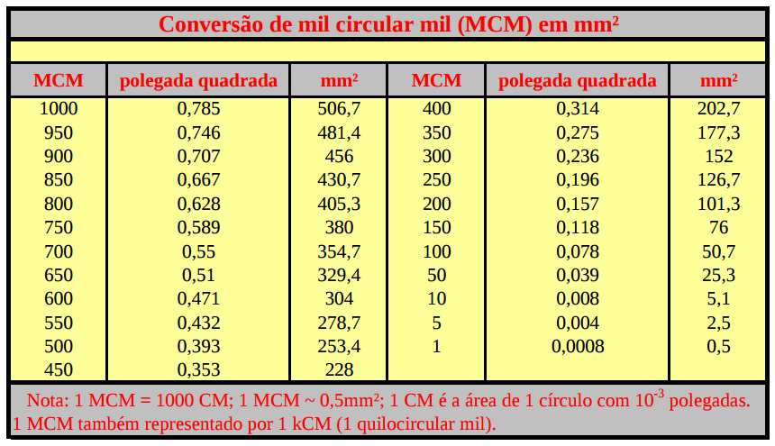
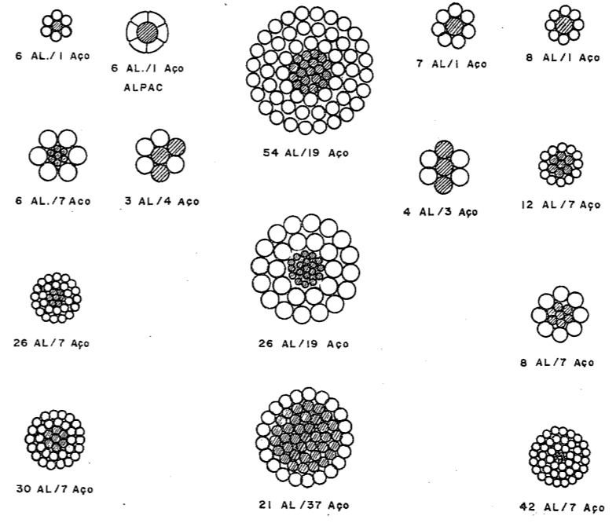
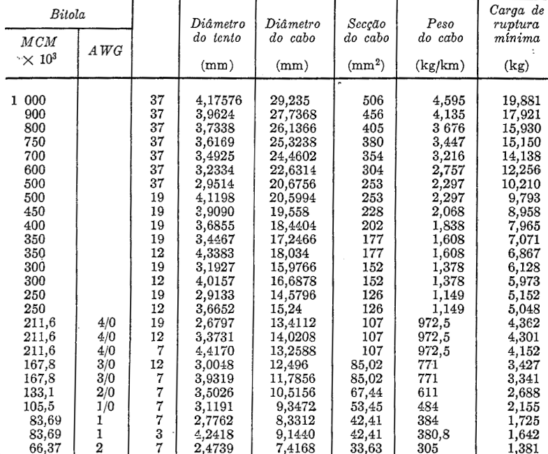
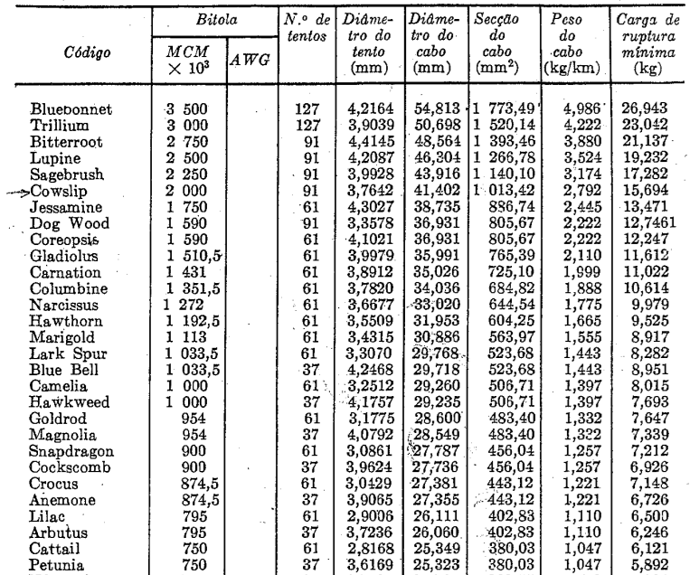
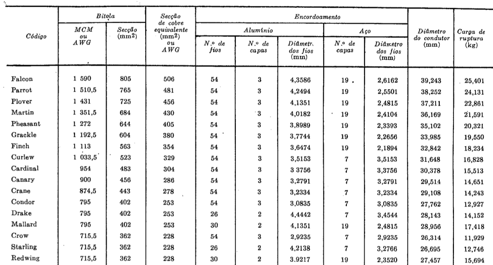

# Condutores elétricos para tensões elevadas e suas características

## Materiais Utilizados

> Constituem os elementos ativos propriamente ditos das linhas de transmissão, devendo, portanto, possuir características especiais.

Sua escolha adequada representa um problema de fundamental importância no dimencionamento das linhas, pois não só depende dela o bom desempenho da linha, como tem importantes implicações de natureza econômica.

Condutores ideais para linhas aéreas de transmissão seriam aqueles que pudessem apresentar as seguintes características:

- alta condutibilidade elétrica
- baixo custo
- boa resistência mecânica
- baixo peso específico
- alta resistência a oxidação e à corrosão por agentes químicos

> Dentre os metais, que o maior número dessas propriedades possuem, estão o **Cobre** e o **Alumínio**.

Houve certa concorrência entre Cobre e Alumínio no início da concepção do sistema elétrico, sendo as principais desvantagens do Alumínio, seu custo ainda elevado em relação ao Cobre e sua menor resistência mecânica, essa última sendo compensada pelo uso dos cabos de Alumínio com alma de aço CAA(*Aluminium Conductor Steel Reinforced - ACSR*)

Entre 1938 e 1945 a evolução da tecnologia do Alumínio reduzio seu custo drasticamente e o Cobre foi definitivamente substituído pelo Alumínio em linhas de transmissão. 

## Condutores Padronizados

Em linhas de transmissão, o uso de fios foi praticamente abandonado em favor dos cabos, obtidos por encordoamento de fios elementares.

Como são inúmeras as composições possíveis para obtenção de uma mesma secção útil de condutores, os fabricantes padronizaram sua fabricação não só quanto ao número de filamentos como também quanto às secções, seguindo tabelas de fabricação dos Estados Unidos e da Europa.

> No Brasil, a padronização das secções adotadas pela ABNT para cabos de Alumínio, Alumínio-Aço e cabos de Cobre nu, baseia-se na padronização americana **AWG** (*American Wire Gauge*). 

A AWG se baseia em uma unidade de área denominada *circular mil* que correnponde à área de um círculo cujo diâmetro é igual a um milésimo de polegadas, ou 0,0005067074 mm².

> De acordo com esse sistema, os condutores são numerados em ordem de secção decrescente de nº 0 ao nº 36 e em secção crescente 00, 000, 0000, (ou 2/0, 3/0 e 4/0) matendo-se relações constantes entre diâmetros e entre secções.

> Cabos de secções maiores do que 0000 (211,6 MCM) são especificados em CM ou MCM (mil CM).

$$ 1MCM = 10^3 \times 1CM $$

Dessa forma, por exemplo, um cabo 4/0 tem uma área em mm² de:

$$A = 211,6 \cdot 10^3 \cdot 1CM = 211,6 \cdot 10^3 \cdot 0,0005067074 \approx 107 mm^2$$

Outro exemplo, o condutor de CA **Tulip** que tem uma bitola de 336,4 MCM tem em mm² a secção de:

$$A = 336,4 \cdot 10^3 \cdot 1CM = 336,4 \cdot 10^3 \cdot 0,0005067074 \approx 170 mm^2$$

Em transmissão e distribuição a prática recomendou e o uso estabeleceu bitolas mínimas de condutores de Alumínio com alma de aço a bitola nº 4 a qual corresponde uma secção de 41.740 CM

## Padronização Brasileira

### Cabos de Cobre

Cabos nus de cobre devem ser especificados através da indicação de:

- secção em milímetros quadrados
- composição ou número de filamentos
- classe de encordoamento

Bitolas vão de 13,3 mm² (6 AWG) até 645,2 mm² (1.000 MCM)

### Cabos de Alumínio e Alumínio-Aço

Sua designação deve ser feita pela área nominal da secção de Alumínio expressa em mm², pela formação, pelo tipo (CA ou CAA), pela classe de encordoamento correspondente e eventualmente pela referência comercial.

É muito comum no Brasil a designação dos cabos de Alumínio (CA) e Alumínio com alma de aço(CAA) atravé do **código canadense de referências comerciais**.

De acordo com esse código há para cada tipo de cabo uma família de nomes através dos quais cada bitola fica completamente definida.

Assim, para os cabos CA, as palavras código são **nomes de flores**, e para os cabos CAA as palavras código são **nomes de aves**, em ambos os casos na língua inglesa.

Exemplo:

> **TULIP** cabo CA de Alumínio composto de 19 filamentos com área total de 336.400 CM.

> **PENGUIN** cabo CAA composição 1 fio de aço e 6 de Alumínio com uma secção de 125,1 mm². 

## Tabelas de Cabos

### Cobre nu

### Alumínio (CA)

### Alumíno-Aço (CAA)

